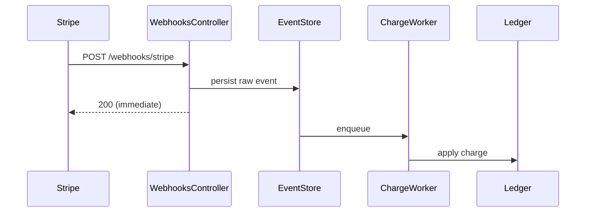

# Create PR description

Write for the human who has to review this. They can already read the diff — it tells them *what* changed. Your job is everything they can't see from it: why this exists, and how we know it works.

Most PRs need three or four lines. Reach for prose last: a diagram, a table, or a link almost always does the job better.

## Step 1: Resolve which changes

Ask the user which changes the description should cover if they didn't say. Offer these explicitly:

1. **The PR on the current branch** — if one exists (`gh pr view` succeeds), this is the likely target. Propose it and confirm.
2. **This branch vs `main`** — the full diff since it diverged, for a PR that doesn't exist yet.
3. **A specific PR** — ask for the number or URL.
4. **Something else** — uncommitted changes, specific files/paths, a range of commits.

Don't guess. If a PR already exists on the branch, name it and confirm rather than silently assuming.

## Step 2: Gather context

Once scope is clear, pull everything that's already knowable before bothering the user:

- **Diff** — `gh pr diff <number>` or `git diff main...HEAD`.
- **Changed files** — `git diff --name-only main...HEAD`.
- **Branch name** — `git branch --show-current`.
- **Commit messages** — `git log main..HEAD --oneline` (often the clearest statement of intent).
- **Existing PR metadata** — if a PR exists, `gh pr view <number>` for title, current body, and linked issues. If the user is *updating* a description, start from what's there.
- **Linked issue** — scan the branch name, commits, and PR body for identifiers (e.g. `INS-123`, `PROJ-456`). If found, pull it from Linear (the `get_issue` MCP tool — `mcp__linear-server__get_issue` in Claude Code, `linear-server_get_issue` in opencode) to source the *why*.

## Step 3: Identify gaps and ask the user

This is the important step. Read the diff and decide what you *don't* have enough confidence to write, then ask for it in one batch. Don't fabricate motivation or evidence.

Ask for:

- **The why** — if the ticket/PR/commits don't make the motivation obvious. What is this fixing or improving, and why now? Is there a ticket, Slack thread, incident, or doc to link?
- **Proof links for claims** — if the change *removes* a controller/endpoint/feature/code and the implied justification is "it's unused" or "it's safe," ask for the link that proves it (Datadog showing no traffic, logs, analytics). Never assert "unused" or "no impact" on your own.
- **Verification you can't see** — tests in the diff are visible; manual QA, prod metrics/logs to watch, and dashboards are not. Ask how it was verified beyond what the diff shows.
- **Risk** — if you can't tell what's risky from the diff, ask what the author is worried about (data migrations, hot paths, irreversible actions, blast radius).

Batch the questions. If context already answers everything, skip asking — but state what you inferred so the user can correct it.

## Step 4: Draft the description

### Default: no headings

Two to five lines. The non-obvious why in a sentence or two, then one line of links — ticket, verification, proof. **This is the right shape for about nine out of ten PRs.** Start here every time.

### Escalating to headings

Add headings only if **at least one** of these holds:

- Schema change, data migration, or another irreversible action
- Control flow or data flow changes across two or more subsystems
- A rollout, feature flag, or ordering constraint the reviewer must know about
- A diagram or table is genuinely needed to follow the change
- The user or a reviewer asked for more detail

When you escalate, **say which condition you met** as you present the draft. Escalating is a response to the change being complicated — not a way to buy more word budget.

### The closed heading set

Pull only from these four, in this order. Include a heading only if you can fill it with substance; skip the rest.

```
## Why            motivation + ticket link
## How it works   the mechanism — diagram or table preferred
## Risk           blast radius, one line
## Verification   links and proof, one line
```

Never invent a heading outside this set — no `Background`, `Implementation Details`, `Testing Strategy`, or `Notes`. Follow-ups and out-of-scope items become a linked issue or a single trailing line.

### Prefer these over prose

- **Diagram** — mermaid, which GitHub renders natively in PR bodies. Use one when the change alters control flow, data flow, or state across components *and* explaining the ordering would otherwise take a paragraph. Never for a one-line fix.
- **Table** — for before/after behavior, a set of related cases, or a flag/config matrix.
- **Links** — code inside the diff as `path/to/file.rb:42`. Code outside the diff as a GitHub permalink pinned to a SHA, never a branch, so it can't rot. Tickets as `Closes INS-123`. Proof as the actual dashboard or query URL.

### Budget

**200 words of prose, maximum.** Diagrams, tables, and link lines don't count — they're the preferred *substitute* for prose, not an addition to it. The default tier usually lands around 40 words.

If you're over: for each extra sentence, name the reviewer question it answers. Can't name one? Delete the sentence.

### Written for humans

- **Never narrate the diff.** No per-file lists of what changed — that's the Files Changed tab.
- **No `This PR...` / `This change...` openers.** Lead with the problem or the mechanism.
- **Cut evaluative filler** — *robust, comprehensive, seamlessly, cleanly, properly, significantly*. They assert quality instead of showing it.
- **Don't explain the obvious** — no language or framework basics, and don't restate what a well-named function already says.
- Write like a colleague leaving a note, not like release notes.

## Examples

### Good — default tier

```markdown
Auth cookie was scoped to the apex domain, so logins on subdomains
silently 401'd. Scopes it per-host instead.

Closes INS-1204 · Verified: `spec/requests/auth/cookie_spec.rb`, plus
staging login on `app.` and `admin.` subdomains.
```

Three lines. Cause and effect in one sentence, then links.

### Good — escalated, with a diagram

Escalated because processing order changed across two subsystems.

````markdown
## Why
Stripe webhooks were processed inline, so a slow ledger write pushed us
past Stripe's 20s timeout and it retried — double-charging some
accounts. INS-1187.

## How it works
Receipt and processing are now split; the endpoint acks immediately.



Idempotency key is Stripe's `event_id`, so a retry is a no-op.

## Risk
Charges apply asynchronously now — a ledger outage delays them instead
of failing the webhook. [Queue depth alarm](https://app.datadoghq.com/...).

## Verification
`spec/workers/charge_worker_spec.rb` covers the retry-is-a-no-op path.
Replayed 3 duplicate events in staging; ledger applied one.
````

### Good — removal, with a table

The table carries what would otherwise be a paragraph, and each claim links to its proof.

```markdown
## Why
The v1 export endpoints predate the async export flow and have had no
traffic in 90 days. Removing them ahead of the Rails 8 upgrade so we
don't port dead controllers. INS-1230.

| Endpoint | Last request | Replacement |
|---|---|---|
| `GET /v1/exports` | none in 90d ([Datadog](https://…)) | `POST /v2/exports` |
| `GET /v1/exports/:id` | none in 90d ([Datadog](https://…)) | `GET /v2/exports/:id` |

## Verification
Datadog queries above cover the full 90d window. `spec/routing/exports_spec.rb`
asserts 404 on the removed routes.
```

### Bad — the same auth fix, written badly

```markdown
## Why
This PR refactors the authentication cookie logic to be more robust.
```
→ `This PR` opener, filler adjective, and it never says what was broken. There is no why here.

```markdown
## What
- Updated `app/controllers/sessions_controller.rb` to change the cookie domain
- Modified `config/initializers/session_store.rb`
- Added a new helper method `cookie_domain_for`
- Updated 3 spec files

The `cookie_domain_for` helper takes a request object and returns the
appropriate domain string for that request.
```
→ A changelog of the diff, then a sentence explaining what the method name already says.

```markdown
## Risk
Low risk. This change is well-tested and should not impact users.
```
→ Says nothing, and asserts safety with no proof.

```markdown
## Verification
- Ran the test suite
- Manually tested
```
→ Neither is evidence. Which specs? What did you actually do?

```markdown
## Notes
N/A
```
→ Padding, and a heading outside the set.

**All of it collapses to the three-line default-tier example above.**

## Step 5: Present and apply

Show the draft. If you escalated to headings, name the condition that justified it. Then offer to apply it — only with explicit confirmation:

- Existing PR → `gh pr edit <number> --body "..."`.
- No PR yet → offer to create it (`gh pr create`), but confirm title and base first.

Don't edit or create the PR without a clear go-ahead.

## Guardrails

- **Start headingless.** Headings are opt-in, gated, and drawn only from the closed set of four. Never invent one; never include one you can't fill with substance.
- **Prose is the fallback.** If a diagram, table, or link conveys it, that's what ships.
- **Don't guess the why.** If the motivation isn't in the ticket/PR/commits, ask. A missing why is the most common reason a description fails its job.
- **Don't assert "unused" / "safe" / "no impact" without a link.** Ask for the proof; if there is none, soften the claim.
- **Omit, don't pad.** Drop what doesn't apply instead of filling it. Never narrate the diff.
- **Don't apply to the PR without confirmation.** Drafting is not publishing.
- **If the diff is empty** (nothing uncommitted, branch even with main, PR has no changes), say so and stop — there's nothing to describe.
